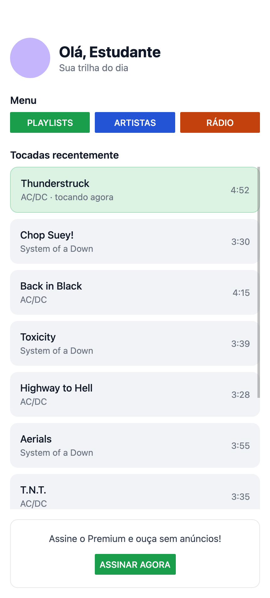

# Tarefa — App de músicas

Refaça a tela do print em React Native.

**Cabeçalho**
Foto fictícia (ou um círculo colorido) + textos "Olá, Estudante" e subtítulo.

**Menu**
Três botões lado a lado.

**Tocadas recentemente**
Lista de 10+ cartões dentro do ScrollView rolável. Nome da música e artista à
esquerda, duração à direita.

**Chamada para ação**
Um texto e um botão centralizados para o estudante assinar o plano Premium.
